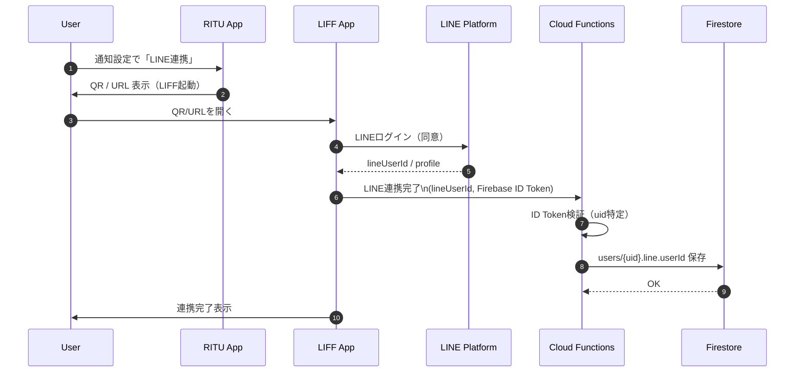

- API エンドポイント: `POST /v1/line/login`（認証必須）で LINE Login の ID トークンを検証し、`users/{uid}.notificationSettings.lineUserId` を保存する。
- もし `users/{uid}` が存在しない場合は、暫定ユーザーを作成して通知設定を保存する。
- LINE Login のリダイレクト情報（code/state/liffClientId/liffRedirectUri）が送信された場合は、`notificationSettings.lineLoginContext` に保存する。
- 必須環境変数: バックエンド `LINE_LOGIN_CHANNEL_ID`（LINE Login Channel ID）、フロントエンド `VITE_LINE_LIFF_ID`（LIFF ID）。
